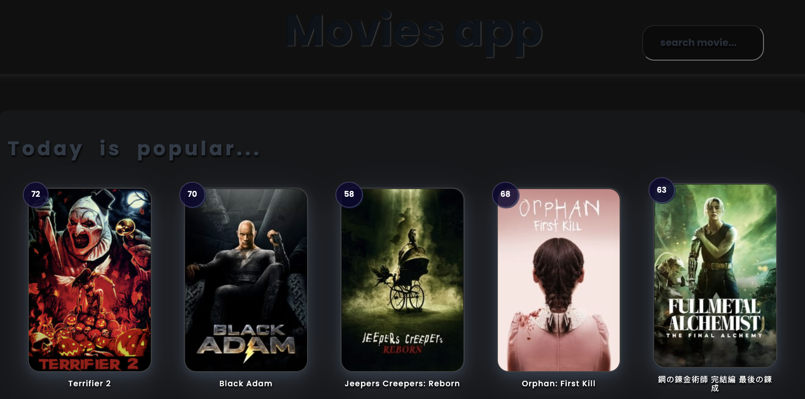
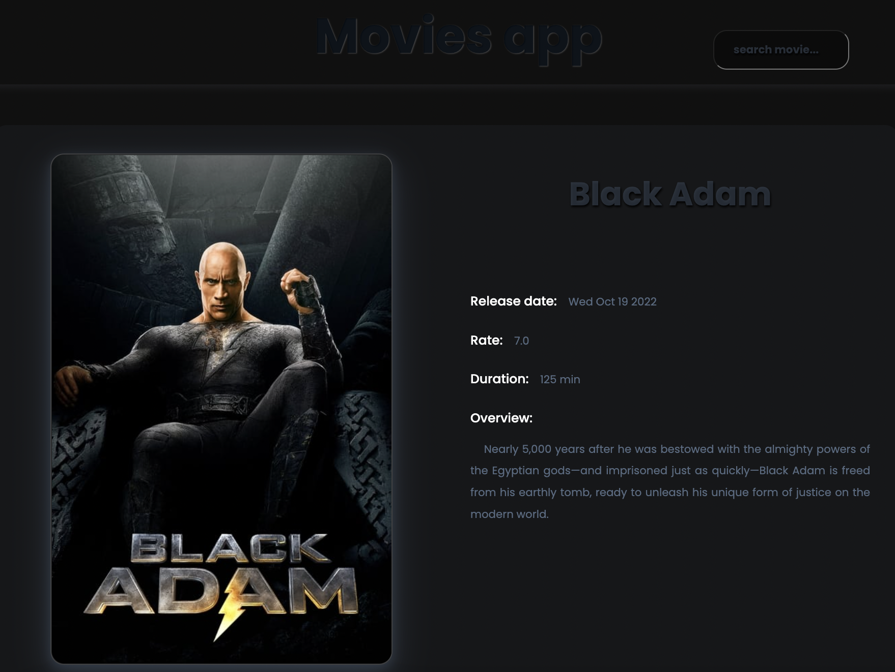

# Home Work 44. Movies app. Part 2.

This repository contains the source code of the Movies App.

To start use:

`mpm run serve`

### `The Movie Database API`

[API Docs](https://developers.themoviedb.org/)

Потрібно додати поле для пошуку фільмів у хедері. Після натискання на кнопку пошуку, відобразити результати пошуку на сторінці за аналогією як робили movieDetails.

Що потрібно зробити:

* Реалізувати функціонал пошуку фільмів     
* Ендпоінт, який потрібно використовувати - Search Movies   
* На сторінці результатів пошуку має бути можливість перейти на перегляд деталей
фільму   
* Після перезавантаження сторінки, результати мають відображатися, якщо є квері параметр    
* Залити все на github у створений репозиторій. (хто хоче зробити pull request) 
* При здачі завдання просто додати посилання на github  
