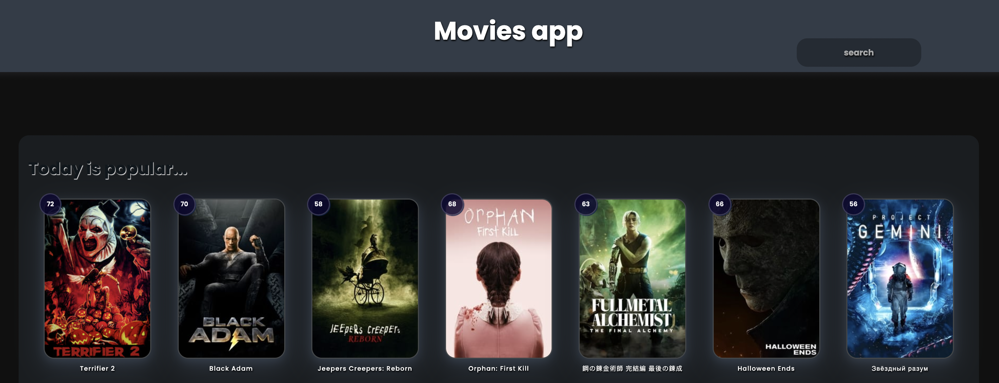

# Home Work 43. Movies app. Part 1.

This repository contains the source code of the Movies App.

To start use:

`mpm run serve`

### `The Movie Database API`

[API Docs](https://developers.themoviedb.org/)

Що потрібно зробити:   

* Створити репозиторій на github    
* Зареєструватися на themoviedb     
* Наслідуючи інструкції розгорнути у себе локально проект movies-app    
* Відобразити на сторінці дані із трьох запитів: Get Popular, Get Top Rated, Get Upcoming   
* Залити все на github у створений репозиторій. (хто хоче зробити pull request)    
* При здачі завдання просто додати посилання на github  